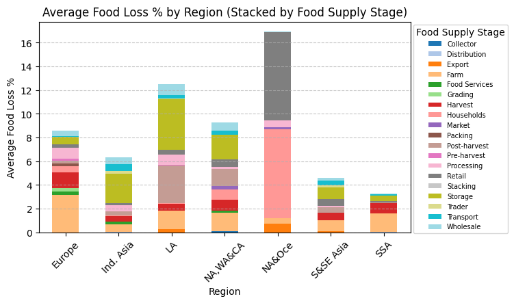
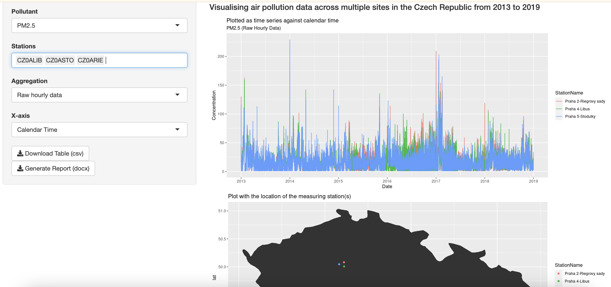

## Projects

### Analytical study of food loss & food production emissions

This study was part of my Master’s thesis. While this analysis focuses on the exploratory aspect, the full thesis also included a statistical regression study examining key influencing variables, their impact, and predictive models. The study analyzes global food loss and food system supply chain GHG emissions across different regions, exploring how these trends have evolved over the past 30 years and the factors driving them. While my thesis research was fully conducted using R, this study has been implemented in Python using Pandas and Matplotlib. A brief [write-up](https://docs.google.com/document/d/1GdhhZGOD8YIs-QQkEvlWfPy8vSPkYUQSlZd0KbWeyiI/edit?usp=sharing) highlights the key findings, while a more detailed [report](https://docs.google.com/document/d/1PyNaTEKX0RZd85M2WnR4LdbSpuRRuu3Kf91zYRdwaQ8/edit?usp=sharing) provides an in-depth analysis.

[View code on Colab](https://colab.research.google.com/drive/1tjFqY0hoOoS7MA11jb0c8z0Q4ZKl4ape#scrollTo=m0kHspJ1sgDp)

---

### Visualising air pollution data using R-Shiny App

A R-Shiny app which visualises air pollution data collected across multiple sites in the Czech Republic from 2013 to 2019. The app is available [here](https://adil-sahab-16.shinyapps.io/Shinyapps_io/).

[View code on Github](https://github.com/adilsahab16/Visualising_air_pollution_data_using_R-Shiny)

---

