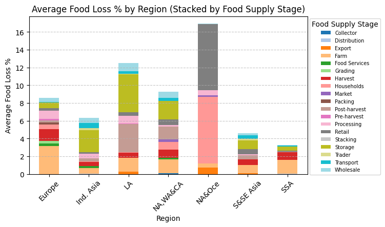
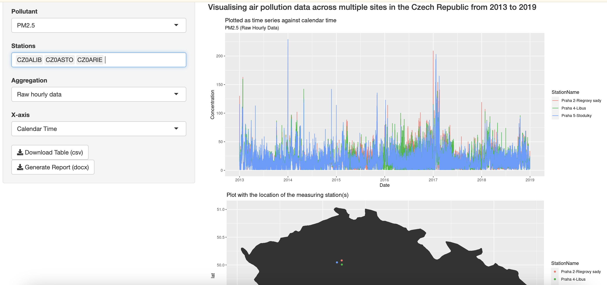

## Projects

### World Food Waste Analytics Chatbot

*Python · SQLite · Streamlit · Anthropic API · Plotly*

A natural language analytics chatbot for querying a food loss and GHG emissions database across four public sources (FAO, World Bank, PIK, EDGAR), cleaned and modelled as part of original thesis research. Ask a question in plain English; the agentic loop selects the right tool, runs parameterised SQL, and returns a data-driven answer with an interactive chart. The project has two parallel goals: build something analytically useful, and learn how Claude and the Anthropic API work in practice — tool calling and the agentic loop.

Requirements written before any code: a full PRD converted into a living `CLAUDE_CONTEXT.md` that directed every Claude Code session, and each phase committed and tested before the next began. Every architectural choice is traceable to a documented decision.`DATA_MODE` environment variable controls whether the app loads from `data/raw/` (full dataset,
local only) or `data/sample/` (curated regional subset, committed to repo for the live demo).

**[[Live Demo]](https://adilsahab16-food-waste-analytics-chatbot.streamlit.app) · [[GitHub]](https://github.com/adilsahab16/food-waste-analytics-chatbot)**

---

### Analytical study of food loss & food production emissions

This study was part of my Master’s thesis. While this analysis focuses on the exploratory aspect, the full thesis also included a statistical regression study examining key influencing variables, their impact, and predictive models. The study analyzes global food loss and food system supply chain GHG emissions across different regions, exploring how these trends have evolved over the past 30 years and the factors driving them. While my thesis research was fully conducted using R, this study has been implemented in Python using Pandas and Matplotlib. A brief [write-up](https://docs.google.com/document/d/1GdhhZGOD8YIs-QQkEvlWfPy8vSPkYUQSlZd0KbWeyiI/edit?usp=sharing) highlights the key findings, while a more detailed [report](https://docs.google.com/document/d/1PyNaTEKX0RZd85M2WnR4LdbSpuRRuu3Kf91zYRdwaQ8/edit?usp=sharing) provides an in-depth analysis.

[View code on Colab](https://colab.research.google.com/drive/1tjFqY0hoOoS7MA11jb0c8z0Q4ZKl4ape#scrollTo=m0kHspJ1sgDp)

---

### Visualising air pollution data using R-Shiny App

A R-Shiny app which visualises air pollution data collected across multiple sites in the Czech Republic from 2013 to 2019. The app is available [here](https://adil-sahab-16.shinyapps.io/Shinyapps_io/).

[View code on Github](https://github.com/adilsahab16/Visualising_air_pollution_data_using_R-Shiny)

---

